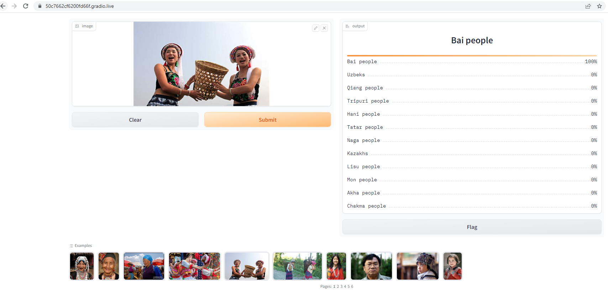

# Ethnic-Group-Recognizer

It's an image classification model from data collection, cleaning, model training, deployment and API integration.  

Our Ethnic Group Recognizer can classify 12 different types of Ethnic groups all over world. Our model can provide upto +-86% accurate result.  

The types of Ethinic groups which I worked on are given below-  

1. Akha people
2. Bai people
3. Chakma people
4. Hani people
5. Kazakhs
6. Lisu people
7. Mon people
8. Naga people
9. Qiang people
10. Tatar people
11. Tripuri people
12. Uzbeks

# Dataset Preparation
**Data Collection:** Data is downloaded from DuckDuckGo search engine using the `Ethnic Group` name. eg: Akha People, Tatar People, Qiang People etc. using `search_images_ddg('Akha People')` method from fastai. 

**DataLoader:** I used fastai DataBlock API to set up the DataLoader.  

**Data Augmentation:** Fastai provides a default data augmentation which operates in GPU.  
Detail implementation of data augmentation can be found in `notebooks/data_preparation.ipynb`.

# Training and Data Cleaning

**Training:** Fine-tuned a resnet34 model for 4 times with 10 epochs each and got upto ~86% accuracy from initial ~60% accuracy.  

**Data Cleaning:** This part took the highest time. Since I collected data from browser, there were many noises such as some data didn't have ethnic people images. Those contains some field or architecture images. I cleaned and updated those noises using fastai ImageClassifierCleaner. I cleaned the data each time after training or finetuning, except for the last time which was the final iteration of the model. After final iteration I exported the model as `.pkl` file. 

# Model Deployment
I deployed the model to `HuggingFace Spaces Gradio App`. The implementation can be found in `deployment` folder. You can visualize and check the models output from [here](https://huggingface.co/spaces/MdTanvirHossain/Ethnic-Group-Recognizer).  

**Gradio live demo:**  
 

**Huggingface Space demo:**  
 

**Localhost demo:**  
 

# API integration with GitHub Pages
The deployed model API is integrated [here](https://mdtanvirhossaintusher.github.io/Ethnic_Group_Recognizer/) in GitHub Pages Website. Implementation and other details can be found in `docs` folder.
